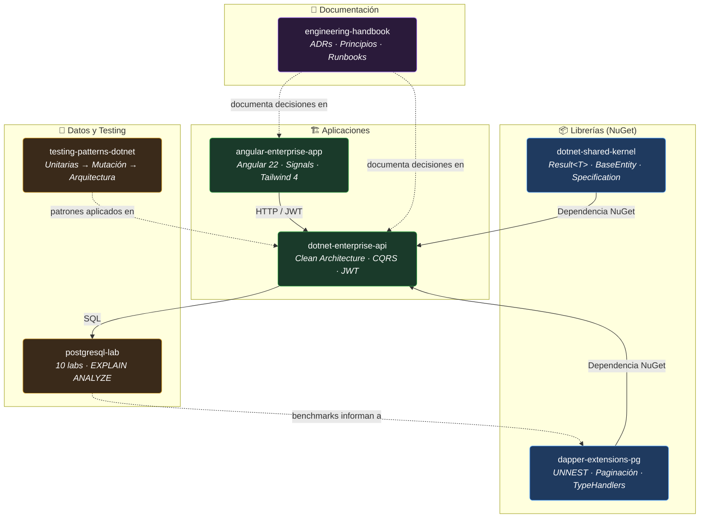

<!-- Section: Header -->

> [🇺🇸 English](README.md) | 🇪🇸 Español

# Hola, soy Erickson Lopez 👋
### Ingeniero de Software y Arquitecto

 

 

 

## 📑 Tabla de Contenidos

- [Bienvenido al Ecosistema](#bienvenido-al-ecosistema)
- [Matriz de Repositorios](#matriz-de-repositorios)
- [Mapa de Arquitectura](#mapa-de-arquitectura)
- [Panorama Tecnológico](#panorama-tecnológico)
- [Principios de Ingeniería](#principios-de-ingeniería)
- [Estándares de los Repositorios](#estándares-de-los-repositorios)
- [Orden de Lectura Recomendado](#orden-de-lectura-recomendado)
- [Iniciativas Actuales y Roadmap](#iniciativas-actuales-y-roadmap)
- [Contribución](#contribución)
- [Licencia](#licencia)

---

## 🚀 Bienvenido al Ecosistema

> [!NOTE]
> **Bienvenido a mi espacio de pruebas de ingeniería y biblioteca de referencia técnica. Soy [Erickson Lopez](https://linkedin.com/in/ericksonlopezf).** 
> Este espacio va más allá de un portafolio tradicional. Es un ecosistema vivo donde los conceptos arquitectónicos se encuentran con código listo para producción.

Cada repositorio aquí existe porque resuelve un problema concreto que surge en la ingeniería de software empresarial. Juntos forman un ecosistema interconectado donde:

- 📦 **Librerías** (`dotnet-shared-kernel`, `dapper-extensions-pg`) proporcionan abstracciones reutilizables.
- 🏗️ **Implementaciones de referencia** (`dotnet-enterprise-api`, `angular-enterprise-app`) demuestran cómo estas librerías se componen en aplicaciones robustas.
- 🔬 **Laboratorios** (`postgresql-lab`) proporcionan benchmarks reproducibles con resultados medidos de `EXPLAIN ANALYZE`—no solo teoría.
- 🧪 **Patrones de testing** (`testing-patterns-dotnet`) exploran el espectro desde pruebas unitarias hasta pruebas de arquitectura.
- 📖 **Documentación** (`engineering-handbook`) registra cada decisión arquitectónica con enlaces directos al código que la implementa.

> [!TIP]
> **El Objetivo:** Deberías poder navegar sin problemas desde una **decisión arquitectónica (ADR)** → al **patrón que la implementa** → al **benchmark que la valida**.

 

---

## 🗂️ Matriz de Repositorios

Aquí tienes la distribución actual del ecosistema. Todos los proyectos se mantienen activamente y están respaldados por integración continua.

| Repositorio | Tipo | Lenguaje | Estado | CI | Descripción |
|:--|:--|:--|:--|:--|:--|
| [`dotnet-shared-kernel`](https://github.com/ericksonlopezf/dotnet-shared-kernel) | 📦 Librería | C# / .NET 10 |  |  | BaseEntity, Result\<T\>, ValueObject, Specification. |
| [`dapper-extensions-pg`](https://github.com/ericksonlopezf/dapper-extensions-pg) | 📦 Librería | C# / .NET 10 |  |  | Operaciones bulk UNNEST, paginación keyset, type handlers avanzados. |
| [`testing-patterns-dotnet`](https://github.com/ericksonlopezf/testing-patterns-dotnet) | 📚 Referencia | C# / .NET 10 |  |  | 5 capítulos: Unitarias → Integración → Mutación → Arquitectura. |
| [`dotnet-enterprise-api`](https://github.com/ericksonlopezf/dotnet-enterprise-api) | 🏗️ Plantilla | C# / .NET 10 |  |  | Clean Architecture + CQRS + JWT + Minimal APIs. |
| [`angular-enterprise-app`](https://github.com/ericksonlopezf/angular-enterprise-app) | 🏗️ Plantilla | TypeScript |  |  | Angular 22 + Signals + Tailwind 4 — Dashboard, CRUD, Auth. |
| [`postgresql-lab`](https://github.com/ericksonlopezf/postgresql-lab) | 🔬 Laboratorio | SQL |  |  | 10 laboratorios, 2.2M filas, benchmarks reales con EXPLAIN ANALYZE. |
| [`engineering-handbook`](https://github.com/ericksonlopezf/engineering-handbook) | 📖 Documentación | Markdown |  | — | ADRs, principios de diseño, y runbooks operativos. |

 

---

## 🗺️ Mapa de Arquitectura

El ecosistema está diseñado para ser altamente cohesivo. Este mapa de dependencias muestra cómo interactúan las piezas.

 

---

## 🛠️ Panorama Tecnológico

En lugar de enumerar cada herramienta, aquí están las tecnologías y patrones principales que definen la arquitectura, rendimiento y seguridad de este ecosistema.

### 🏗️ Arquitectura Principal y Patrones
- **Framework de Backend:** .NET 10 (C# 13) — Clean Architecture, Domain-Driven Design (Modelos de Dominio Ricos).
- **Framework de Frontend:** Angular 22 (TypeScript) — Modular, Componentes Standalone, Signals, Tailwind CSS 4.
- **Patrones de Diseño:** Patrón Result (manejo de errores), CQRS (MediatR), Specification, Patrón Outbox.

### 💾 Datos y Alto Rendimiento
- **Base de Datos:** PostgreSQL 17 — Uso avanzado de JSONB, Búsqueda Full-Text (GIN), Paginación Keyset (0.31ms en la página 25k).
- **Acceso a Datos:** Dapper (Micro-ORM) — Cero magia, consultas explícitas. Usa arrays `UNNEST` para un rendimiento de inserción de 125k filas/seg.
- **Caché y Mensajería:** Redis para caché distribuido; RabbitMQ / Kafka para flujos basados en eventos.

### 🛡️ Seguridad Empresarial y Calidad
- **Criptografía:** BCrypt para hashing; DPAPI, AES, y Shamir Secret Sharing para manejo avanzado de secretos.
- **Pipeline DevSecOps:** GitHub Actions integrado con SonarQube, CodeQL, Trivy, y Gitleaks para auditoría automatizada.
- **Dominio del Testing:** xUnit, AutoFixture, Bogus para pruebas unitarias/integración; Testcontainers para I/O; Stryker.NET para pruebas de mutación.

### ☁️ Cloud, Infraestructura y Observabilidad
- **Infraestructura como Código:** Docker, Terraform, con un roadmap hacia la orquestación con Kubernetes.
- **Observabilidad:** Trazabilidad distribuida con OpenTelemetry y logging estructurado para preparación a producción.

 

---

## 🧠 Principios de Ingeniería

> [!IMPORTANT]
> La filosofía que impulsa este ecosistema es **Simplicidad sobre astucia** y **Medir, no adivinar**.

### Objetivos de Diseño

- 🎯 **Explícito sobre implícito:** Usamos `Result<T>` en lugar de lanzar excepciones para la lógica de negocio. Escribimos SQL puro en lugar de depender de la generación opaca de un ORM.
- 🧩 **Composición sobre herencia:** El kernel compartido proporciona abstracciones ligeras consumidas por la API Empresarial sin cadenas de herencia profundas.
- 📊 **Medir, no adivinar:** Cada afirmación de rendimiento está respaldada por benchmarks de `postgresql-lab` (ej. demostrando el rendimiento de 125k filas/seg de UNNEST).
- 📝 **Documentar el 'Por qué':** El `engineering-handbook` aloja los Registros de Decisiones de Arquitectura (ADRs) para explicar el razonamiento, no solo los resultados.
- 🧪 **Probar comportamiento, no implementación:** Las pruebas unitarias verifican reglas estrictas de dominio; las pruebas de integración verifican contratos de API.

### Decisiones Clave de Arquitectura (ADRs)

| ADR | Decisión | Evidencia Tangible |
|:--|:--|:--|
| [**ADR-001**](https://github.com/ericksonlopezf/engineering-handbook/blob/main/adrs/ADR-001-result-over-exceptions.md) | `Result<T>` sobre excepciones para fallos de negocio | 0 bloques catch en `enterprise-api` |
| [**ADR-002**](https://github.com/ericksonlopezf/engineering-handbook/blob/main/adrs/ADR-002-dapper-over-efcore.md) | Dapper sobre Entity Framework Core | Rendimiento de inserción masiva 15x más rápido |
| [**ADR-003**](https://github.com/ericksonlopezf/engineering-handbook/blob/main/adrs/ADR-003-signals-over-ngrx.md) | Angular Signals sobre NgRx | 60% menos código repetitivo, coste de bundle de 0 KB |
| [**ADR-004**](https://github.com/ericksonlopezf/engineering-handbook/blob/main/adrs/ADR-004-keyset-pagination.md) | Paginación Keyset sobre OFFSET | Tiempo constante de 0.31ms en la página 25k |
| [**ADR-005**](https://github.com/ericksonlopezf/engineering-handbook/blob/main/adrs/ADR-005-fluent-validation-pipeline.md) | FluentValidation en pipeline de MediatR | Los handlers nunca reciben entrada inválida |

 

---

## 📏 Estándares de los Repositorios

La consistencia es clave en todo el ecosistema. Cada repositorio se adhiere estrictamente a estas líneas base.

### Estándar Estructural
Cada repositorio cuenta con un diseño estándar: `src/`, `tests/` (Unitarias/Integración), `docs/`, un `README.md` detallado, `.github/workflows/ci.yml`, y un `.editorconfig`.

### Gobernanza
Cada repositorio incluye la suite completa de gobernanza OSS: `LICENSE`, `CONTRIBUTING.md`, `CODE_OF_CONDUCT.md`, `SECURITY.md`, `CHANGELOG.md`, plantillas de issues, plantilla de PR, y Dependabot.

### Calidad y Rendimiento
- **Compilaciones:** `TreatWarningsAsErrors = true` en todos los proyectos .NET.
- **Cobertura:** Objetivo del 100% de cobertura de pruebas para los invariantes de dominio.
- **CI/CD:** Desarrollo Trunk-based donde `main` siempre es desplegable. Los repos .NET comparten un [workflow reutilizable](https://github.com/ericksonlopezf/dotnet-shared-kernel/blob/main/.github/workflows/dotnet-build-test.yml) para build y test, reduciendo la duplicación de CI.
- **Rendimiento:** Paginación sub-milisegundo, tiempos de consulta FTS < 5ms, y bundles lazy-loading de Angular altamente optimizados (< 1.5 MB de carga inicial).

 

---

## 🧭 Orden de Lectura Recomendado

Si estás explorando el ecosistema por primera vez, te recomiendo este camino para ver cómo encajan las piezas:

1. 📖 **[Principios de Clean Architecture](https://github.com/ericksonlopezf/engineering-handbook/blob/main/principles/clean-architecture.md)** — Entiende las capas principales y reglas de dependencia.
2. 📦 **[`dotnet-shared-kernel`](https://github.com/ericksonlopezf/dotnet-shared-kernel)** — Revisa los tipos fundamentales `Result<T>`, `BaseEntity` y `ValueObject`.
3. 📦 **[`dapper-extensions-pg`](https://github.com/ericksonlopezf/dapper-extensions-pg)** — Explora las extensiones de PostgreSQL de alto rendimiento (UNNEST, Keyset).
4. 🔬 **[`postgresql-lab`](https://github.com/ericksonlopezf/postgresql-lab)** — Observa los benchmarks SQL puros que validan las decisiones de acceso a datos.
5. 🏗️ **[`dotnet-enterprise-api`](https://github.com/ericksonlopezf/dotnet-enterprise-api)** — Descubre cómo el kernel y el acceso a datos se componen en una API con Clean Architecture.
6. 🏗️ **[`angular-enterprise-app`](https://github.com/ericksonlopezf/angular-enterprise-app)** — Revisa la implementación moderna con Angular 22 Signals consumiendo la API.
7. 📚 **[`testing-patterns-dotnet`](https://github.com/ericksonlopezf/testing-patterns-dotnet)** — Profundiza en las estrategias de testing que mantienen el código robusto.

 

---

## 🔮 Iniciativas Actuales y Roadmap

El ecosistema está construido para escalar a más de 20 repositorios sin perder cohesión.

### Fase Actual: Consolidación
- [x] Publicar `dotnet-shared-kernel` y `dapper-extensions-pg` en NuGet.org
- [x] Mejorar la cobertura de pruebas de integración en `dotnet-enterprise-api` con Testcontainers
- [x] Agregar `CODE_OF_CONDUCT.md` (Contributor Covenant v2.1) a todos los repositorios
- [x] Implementar workflows reutilizables de GitHub Actions en los repositorios .NET
- [x] Agregar reporte de code coverage al CI de `angular-enterprise-app`
- [x] Desplegar reportes de mutación Stryker a GitHub Pages (`testing-patterns-dotnet`)
- [ ] Introducir pruebas E2E (Playwright) a `angular-enterprise-app`

### Visión Futura
- 📡 **Observabilidad:** Trazabilidad distribuida con OpenTelemetry a través de la API y PostgreSQL.
- 📬 **Arquitectura Basada en Eventos:** Patrón Outbox e integración de broker de mensajes.
- 🏢 **Patrones Multi-Tenant:** Arquitectura de un esquema por inquilino apoyándose en el kernel compartido.
- 🚢 **Recetas de Despliegue:** Progresión desde Docker Compose a manifiestos completos de Kubernetes.

 

---

## 🤝 Contribución

Aunque este ecosistema sirve principalmente como arquitectura de referencia personal y espacio de pruebas, las discusiones constructivas, sugerencias y comentarios siempre son bienvenidos. Siéntete libre de abrir un **Issue** en el repositorio correspondiente si detectas un error o deseas discutir un patrón arquitectónico específico.

 

---

## 📄 Licencia

Este ecosistema y sus repositorios son software de código abierto licenciado bajo la **[Licencia MIT](https://opensource.org/licenses/MIT)**. Eres libre de usar estos patrones arquitectónicos e implementaciones de referencia en tus propios proyectos.

 

---

**[engineering-handbook](https://github.com/ericksonlopezf/engineering-handbook)** · Diseñado y construido con cuidado por **Erickson Lopez**.

