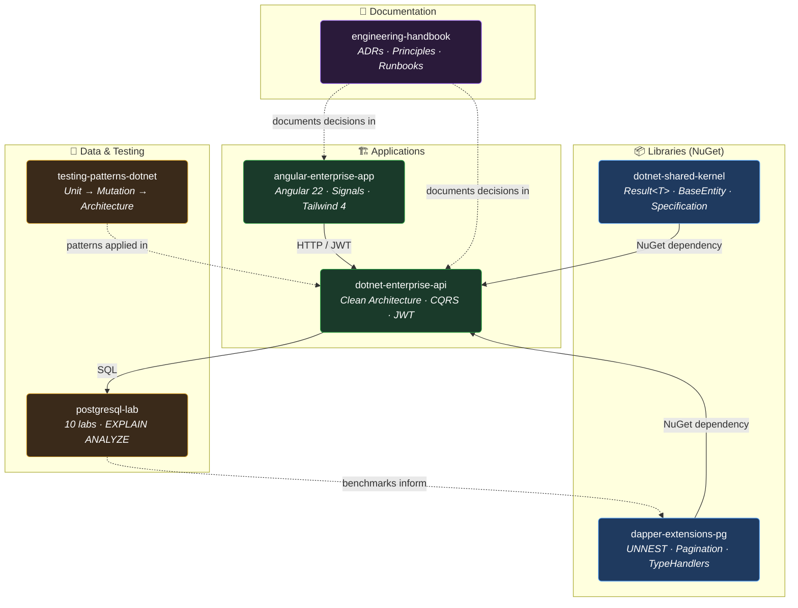

<!-- Section: Header -->

> 🇺🇸 English | [🇪🇸 Español](README-es.md)

# Hi, I'm Erickson Lopez 👋
### Software Engineer & Architect

 

 

 

## 📑 Table of Contents

- [Welcome to the Ecosystem](#welcome-to-the-ecosystem)
- [Repository Matrix](#repository-matrix)
- [Architecture Map](#architecture-map)
- [Technology Landscape](#technology-landscape)
- [Engineering Principles](#engineering-principles)
- [Repository Standards](#repository-standards)
- [Recommended Reading Order](#recommended-reading-order)
- [Current Initiatives & Roadmap](#current-initiatives--roadmap)
- [Contributing](#contributing)
- [License](#license)

---

## 🚀 Welcome to the Ecosystem

> [!NOTE]
> **Welcome to my engineering playground and technical reference library. I'm [Erickson Lopez](https://linkedin.com/in/ericksonlopezf).** 
> This space goes beyond a traditional portfolio. It's a living ecosystem where architectural concepts meet production-ready code.

Each repository here exists because it solves a concrete problem that surfaces in enterprise software engineering. Together they form an interconnected ecosystem where:

- 📦 **Libraries** (`dotnet-shared-kernel`, `dapper-extensions-pg`) provide reusable abstractions.
- 🏗️ **Reference implementations** (`dotnet-enterprise-api`, `angular-enterprise-app`) demonstrate how these libraries compose into robust applications.
- 🔬 **Labs** (`postgresql-lab`) provide reproducible benchmarks with measured `EXPLAIN ANALYZE` output—not just theory.
- 🧪 **Testing patterns** (`testing-patterns-dotnet`) explore the spectrum from unit to architecture testing.
- 📖 **Documentation** (`engineering-handbook`) records every architectural decision with direct links to the code that implements it.

> [!TIP]
> **The Goal:** You should be able to navigate seamlessly from an **architectural decision (ADR)** → to the **pattern that implements it** → to the **benchmark that validates it**.

 

---

## 🗂️ Repository Matrix

Here is the current layout of the ecosystem. Every project is actively maintained and backed by continuous integration.

| Repository | Type | Language | Status | CI | Description |
|:--|:--|:--|:--|:--|:--|
| [`dotnet-shared-kernel`](https://github.com/ericksonlopezf/dotnet-shared-kernel) | 📦 Library | C# / .NET 10 |  |  | BaseEntity, Result\<T\>, ValueObject, Specification. |
| [`dapper-extensions-pg`](https://github.com/ericksonlopezf/dapper-extensions-pg) | 📦 Library | C# / .NET 10 |  |  | UNNEST bulk ops, keyset pagination, advanced type handlers. |
| [`testing-patterns-dotnet`](https://github.com/ericksonlopezf/testing-patterns-dotnet) | 📚 Reference | C# / .NET 10 |  |  | 5 chapters: Unit → Integration → Mutation → Architecture testing. |
| [`dotnet-enterprise-api`](https://github.com/ericksonlopezf/dotnet-enterprise-api) | 🏗️ Template | C# / .NET 10 |  |  | Clean Architecture + CQRS + JWT + Minimal APIs. |
| [`angular-enterprise-app`](https://github.com/ericksonlopezf/angular-enterprise-app) | 🏗️ Template | TypeScript |  |  | Angular 22 + Signals + Tailwind 4 — Dashboard, CRUD, Auth. |
| [`postgresql-lab`](https://github.com/ericksonlopezf/postgresql-lab) | 🔬 Lab | SQL |  |  | 10 labs, 2.2M rows, real EXPLAIN ANALYZE benchmarks. |
| [`engineering-handbook`](https://github.com/ericksonlopezf/engineering-handbook) | 📖 Docs | Markdown |  | — | ADRs, design principles, and operational runbooks. |

 

---

## 🗺️ Architecture Map

The ecosystem is designed to be highly cohesive. This dependency map shows how the pieces interact.

 

---

## 🛠️ Technology Landscape

Rather than listing every tool, here are the core technologies and patterns that define this ecosystem's architecture, performance, and security.

### 🏗️ Core Architecture & Patterns
- **Backend Framework:** .NET 10 (C# 13) — Clean Architecture, Domain-Driven Design (Rich Domain Models).
- **Frontend Framework:** Angular 22 (TypeScript) — Modular, Standalone Components, Signals, Tailwind CSS 4.
- **Design Patterns:** Result Pattern (error handling), CQRS (MediatR), Specification, Outbox Pattern.

### 💾 Data & High Performance
- **Database:** PostgreSQL 17 — Advanced usage of JSONB, Full-Text Search (GIN), Keyset Pagination (0.31ms at page 25k).
- **Data Access:** Dapper (Micro-ORM) — Zero magic, explicit queries. Uses `UNNEST` arrays for 125k rows/sec insert throughput.
- **Caching & Messaging:** Redis for distributed caching; RabbitMQ / Kafka for event-driven flows.

### 🛡️ Enterprise Security & Quality
- **Cryptography:** BCrypt for hashing; DPAPI, AES, and Shamir Secret Sharing for advanced secret management.
- **DevSecOps Pipeline:** GitHub Actions integrated with SonarQube, CodeQL, Trivy, and Gitleaks for automated auditing.
- **Testing Mastery:** xUnit, AutoFixture, Bogus for unit/integration; Testcontainers for I/O; Stryker.NET for mutation testing.

### ☁️ Cloud, Infra & Observability
- **Infrastructure as Code:** Docker, Terraform, with a roadmap towards Kubernetes orchestration.
- **Observability:** OpenTelemetry distributed tracing and structured logging for production readiness.

 

---

## 🧠 Engineering Principles

> [!IMPORTANT]
> The philosophy driving this ecosystem is **Simplicity over cleverness** and **Measure, don't guess**.

### Design Goals

- 🎯 **Explicit over implicit:** We use `Result<T>` instead of throwing exceptions for business logic. We write raw SQL instead of relying on opaque ORM generation.
- 🧩 **Composition over inheritance:** The shared kernel provides lean abstractions consumed by the Enterprise API without deep inheritance chains.
- 📊 **Measure, don't guess:** Every performance claim is backed by `postgresql-lab` benchmarks (e.g., proving UNNEST's 125k rows/sec throughput).
- 📝 **Document the 'Why':** The `engineering-handbook` houses Architecture Decision Records (ADRs) to explain reasoning, not just outcomes.
- 🧪 **Test behavior, not implementation:** Unit tests verify strict domain rules; integration tests verify API contracts.

### Key Architecture Decisions (ADRs)

| ADR | Decision | Tangible Evidence |
|:--|:--|:--|
| [**ADR-001**](https://github.com/ericksonlopezf/engineering-handbook/blob/main/adrs/ADR-001-result-over-exceptions.md) | `Result<T>` over exceptions for business failures | 0 catch blocks in `enterprise-api` |
| [**ADR-002**](https://github.com/ericksonlopezf/engineering-handbook/blob/main/adrs/ADR-002-dapper-over-efcore.md) | Dapper over Entity Framework Core | 15x faster bulk insert throughput |
| [**ADR-003**](https://github.com/ericksonlopezf/engineering-handbook/blob/main/adrs/ADR-003-signals-over-ngrx.md) | Angular Signals over NgRx | 60% less boilerplate, 0 KB bundle cost |
| [**ADR-004**](https://github.com/ericksonlopezf/engineering-handbook/blob/main/adrs/ADR-004-keyset-pagination.md) | Keyset pagination over OFFSET | 0.31ms constant time at page 25k |
| [**ADR-005**](https://github.com/ericksonlopezf/engineering-handbook/blob/main/adrs/ADR-005-fluent-validation-pipeline.md) | FluentValidation in MediatR pipeline | Handlers never receive invalid input |

 

---

## 📏 Repository Standards

Consistency is key across the ecosystem. Every repository strictly adheres to these baselines.

### Structural Standard
Every repo features a standard layout: `src/`, `tests/` (Unit/Integration), `docs/`, a comprehensive `README.md`, `.github/workflows/ci.yml`, and an `.editorconfig`.

### Governance
Every repository includes the full OSS governance suite: `LICENSE`, `CONTRIBUTING.md`, `CODE_OF_CONDUCT.md`, `SECURITY.md`, `CHANGELOG.md`, issue templates, PR template, and Dependabot.

### Quality & Performance
- **Builds:** `TreatWarningsAsErrors = true` across all .NET projects.
- **Coverage:** 100% test coverage target for domain invariants.
- **CI/CD:** Trunk-based development where `main` is always deployable. .NET repos share a [reusable workflow](https://github.com/ericksonlopezf/dotnet-shared-kernel/blob/main/.github/workflows/dotnet-build-test.yml) for build & test, reducing CI duplication.
- **Performance:** Sub-millisecond pagination, < 5ms FTS query times, and highly optimized Angular lazy-loading bundles (< 1.5 MB initial load).

 

---

## 🧭 Recommended Reading Order

If you're exploring the ecosystem for the first time, I recommend this path to see how the pieces fit together:

1. 📖 **[Clean Architecture Principles](https://github.com/ericksonlopezf/engineering-handbook/blob/main/principles/clean-architecture.md)** — Understand the core layers and dependency rules.
2. 📦 **[`dotnet-shared-kernel`](https://github.com/ericksonlopezf/dotnet-shared-kernel)** — Review the foundational `Result<T>`, `BaseEntity`, and `ValueObject` types.
3. 📦 **[`dapper-extensions-pg`](https://github.com/ericksonlopezf/dapper-extensions-pg)** — Explore the high-performance PostgreSQL extensions (UNNEST, Keyset).
4. 🔬 **[`postgresql-lab`](https://github.com/ericksonlopezf/postgresql-lab)** — See the raw SQL benchmarks that validate the data access decisions.
5. 🏗️ **[`dotnet-enterprise-api`](https://github.com/ericksonlopezf/dotnet-enterprise-api)** — Discover how the kernel and data access compose into a Clean Architecture API.
6. 🏗️ **[`angular-enterprise-app`](https://github.com/ericksonlopezf/angular-enterprise-app)** — Check out the modern Angular 22 Signals implementation consuming the API.
7. 📚 **[`testing-patterns-dotnet`](https://github.com/ericksonlopezf/testing-patterns-dotnet)** — Dive deep into the testing strategies keeping the code robust.

 

---

## 🔮 Current Initiatives & Roadmap

The ecosystem is built to scale to 20+ repositories without losing cohesion.

### Current Phase: Consolidation
- [x] Publish `dotnet-shared-kernel` and `dapper-extensions-pg` to NuGet.org
- [x] Enhance integration test coverage in `dotnet-enterprise-api` with Testcontainers
- [x] Add `CODE_OF_CONDUCT.md` (Contributor Covenant v2.1) to all repositories
- [x] Implement reusable GitHub Actions workflows across .NET repositories
- [x] Add code coverage reporting to `angular-enterprise-app` CI
- [x] Deploy Stryker mutation reports to GitHub Pages (`testing-patterns-dotnet`)
- [ ] Introduce E2E tests (Playwright) to `angular-enterprise-app`

### Future Vision
- 📡 **Observability:** OpenTelemetry distributed tracing across the API and PostgreSQL.
- 📬 **Event-Driven Architecture:** Outbox pattern and message broker integration.
- 🏢 **Multi-Tenant Patterns:** Schema-per-tenant architecture relying on the shared kernel.
- 🚢 **Deployment Recipes:** Progression from Docker Compose to full Kubernetes manifests.

 

---

## 🤝 Contributing

While this ecosystem serves primarily as a personal reference architecture and engineering playground, constructive discussions, suggestions, and feedback are always welcome. Feel free to open an **Issue** in the relevant repository if you spot a bug or want to discuss a specific architectural pattern.

 

---

## 📄 License

This ecosystem and its repositories are open-sourced software licensed under the **[MIT License](https://opensource.org/licenses/MIT)**. You are free to use these architectural patterns and reference implementations in your own projects.

 

---

**[engineering-handbook](https://github.com/ericksonlopezf/engineering-handbook)** · Designed & built with care by **Erickson Lopez**.

